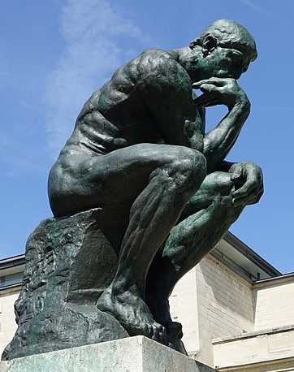

# Sculptor




[](https://goreportcard.com/report/github.com/esonhugh/sculptor)
[](https://opensource.org/licenses/MIT)


Sculptor is a flexible and powerful Go library 
for transforming data from various formats 
(CSV, JSON, etc.) into desired Go struct types.

It is designed to significantly simplify and accelerate the process of data ingestion and formatting.

## Features

- **Ease of use**: Simply define your struct with struct field tag and let sculptor handle the rest.
- **Support for multiple data file formats**: CSV, JSON, and more.
- **Customized your processing**: setup fallbackfuncs and customfuncs to handle your data.
- **More Options**: Set your own delimiter, data parser func and time latency to control the speed of data processing.
- **Efficient handling of large data sets**: Optimize memory usage and performance.

## Installation

```bash
go get github.com/esonhugh/sculptor
```

## Quick Start

```go
package main

import (
        "github.com/esonhugh/sculptor"
	"log"
)

type TestStruct struct {
	Name string `select:"name"`
	Pass string `select:"pass"`
}

func main() {
	Doc := sculptor.NewDataSculptor("test.json").
		SetDocType(sculptor.JSON_DOCUMENT).
		SetQuery("name", "user").
		SetQuery("pass", "pass").
		SetTargetStruct(&TestStruct{})
	go Doc.Do()
	for i := range Doc.ConstructedOutput {
		log.Print(i)
	}
}
```

## Demo

[](https://youtu.be/mz3x-h1qAvU "demo of merging oneforall.csv and subfinder output")


## More Example

Checkout the [test](./test) folder to see more examples.

## Doc

godoc: [https://pkg.go.dev/github.com/esonhugh/sculptor](https://pkg.go.dev/github.com/esonhugh/sculptor)

## Contributing

welcome contributions! Free for fork and Pull Request. 

## License

sculptor is licensed under the MIT License. See [LICENSE](LICENSE) for more details.

---

Made with :heart: by [Esonhugh](https://eson.ninja)

Inspired by [AkaAny/gormja_core2](https://github.com/AkaAny/gormja_core2)

Inspired by [Trickest](https://trickest.com/)